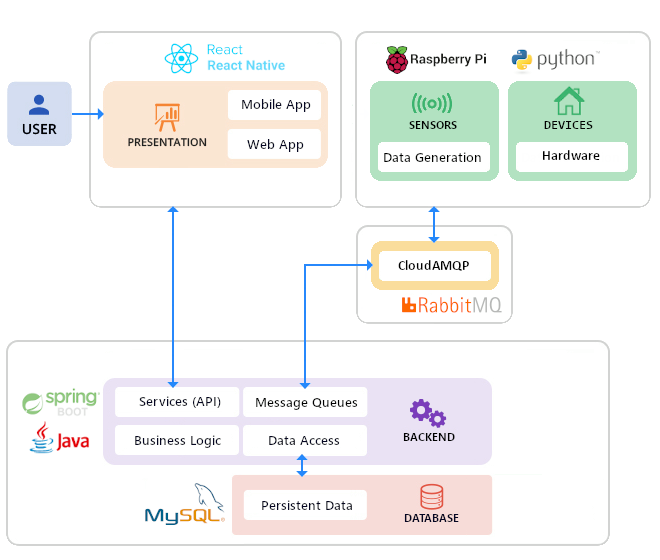
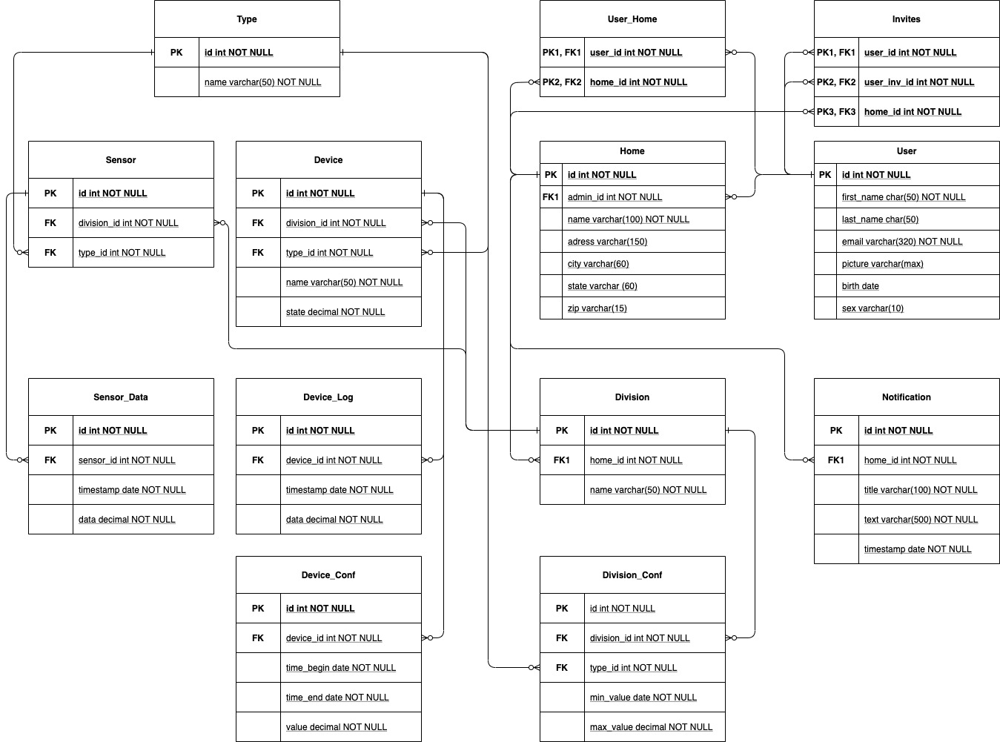
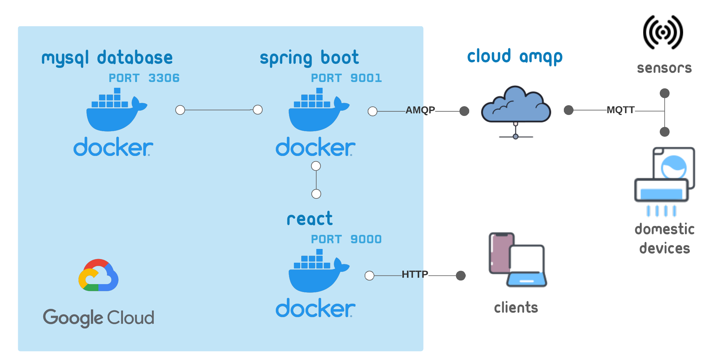

# IES_Project - GeaniHouse

## Backlog

The tool we used to actively manage the backlog was Jira. [https://geanihouse.atlassian.net/browse/GEAN](https://geanihouse.atlassian.net/browse/GEAN)

## Our Product

The idea of our project for the assignment of the Introduction to Software Engineering course, is the implementation of a system capable of monitoring, configuring a smart House and all its devices.  

## Accesses

- [App Link](http://34.89.75.14:9000)
- [API Documentation](http://34.89.75.14:9001/api/v1/swagger-ui.html)

| Username | Password     |
| -------- | ------------ |
| chico    | randomquerty |
| dgomes   | randomquerty |

## Work  Methodology and Backlog Management

The approach for this work will be the Scrum Agile Methods, where we will define to-do features for every member of the group. Every week we will discuss what needs to be done  and what was done, updating the backlog. To manage every sprint and the backlog we will use the Jira Software.

## Roles

- Team Manager - Mário Silva
- DevOps Master - Daniel Gomes
- Product Owner - Leandro Silva
- Architect - Bruno Bastos

## Personas and  User Stories

### Personas

João is a young man with a lot of interest in new technologies. During the last few years, he  started  wanting to have a smart house where he could program and configure its devices according to his liking. As he works remotely he has a pretty flexible schedule and spends a great amount of time inside his house.

António is a middle aged man that works during the night and needs to automate some electronic processes for his family during the day.

Célia  is an elderly lady that wants to take the advantages that recent technologies have to offer. Since she has a lot of difficulty and really little external help, it would be great if some processes in her house were automated to help her day-to-day life. 

### User Stories

As a user that wants to use the system, I need to register first and then login to authenticate myself.

As a registered user, I want to add devices to be able to control them using the app.

As a registered user, I want to add divisions to be able to control them using the app.

As a registered user, I want to add homes to be able to control them using the app.

As Antonio, I want to be able to configure the cylinder in order to leave the water warm for my family.

As Antonio, I want to give permission to my 12 years old daughter so that she can configure her room devices.

As Antonio, I want to share the access to the smart home app with my wife so that she can verify something if needed.

As João, I want to be able to turn on the air conditioner automatically around 18:00, during half an hour, in order to heat the division.

As João, I want to maintain a temperature of 18°C-24°C throughout the day, to be more comfortable.

As João, I want to receive notifications of the devices' state changes, so I can see what the application is doing. 

As Célia, I want to be able to use default configurations, so that the smart home setup is easier.

## Architeture

### Data Generation

We will be using a temperature sensor, and for other things like humidity and light, all data will be simulated. To run the scripts to simulate data,send the data streams to our Backend, and for the use of sensors, it will be used a Raspberry Pi. We are using python to communicate with the server. 

### Frontend

Template: https://github.com/knledg/react-blur-admin

#### Mobile App

For the mobile app we are using react native since it can be used for cross-platform development for both Android and IOS. 

#### Web App

The web app uses react since the syntax is similar to react native so that we can reuse some of the code for the mobile app.

### Backend

#### Database:

The database management system in use is MySQL. In the beginning we were thinking about a NoSQL database like MongoDB but since we don’t have much experience with this technology we opt for a relational database system. MySQL might have some scalability problems, however, for our project it is more than enough.

#### Relational schema

#### Data Access
To access the data we decided to use the JPA, Java Persistence API, since we got to know it from the Practical Classes and it is  really useful to do SQL Queries, an important aspect because we are using a Relational Database, MySQL.

#### Message Queues:

RabbitMQ is going to receive the messages from the sensors and pass them to the backend. Our choice comes from the fact that rabbitMQ is one of the most used message brokers which makes it easy to find information about it and is easy to integrate in spring-boot.

#### Services (API) + Bizz Logic

For the backend of our System, since we got to know the Spring framework from the practical classes of this course and it was highly recommended by the Teacher, we will use Spring.

## Deployment Diagram

## Project Resources Bookmarks

[Google Drive ](https://drive.google.com/drive/folders/1Nwdul_tBhj4nKEn1nzR1FGi_7EghT7Ay?usp=sharing )

[Jira Backlog](https://geanihouse.atlassian.net/browse/GEAN)

[API Documentation](http://34.89.75.14:9001/api/v1/swagger-ui.html)

*Access credentials for API and application main account:*

Username: chico

Password: randomquerty

